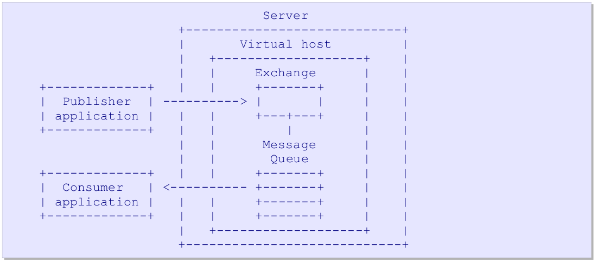
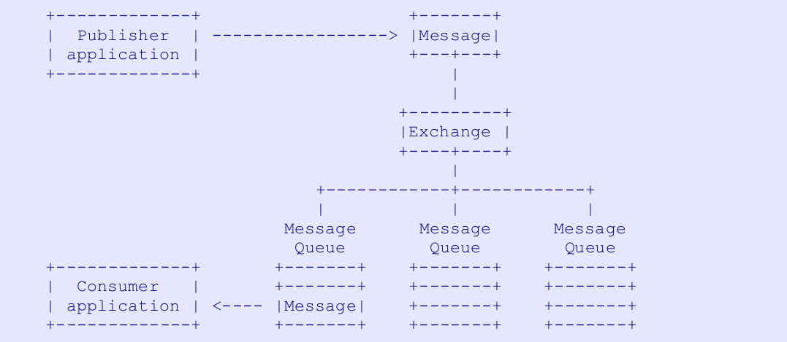

# Resumo da Specification v0-9-1 do AMQP(Advanced Message Queuing Protocol)

``` 
Bibliografia 
 - https://www.amqp.org/
```

[Hokage](#ancora1)

## Arquitetura Geral

### Principais Entidades

Podemos resumir o que é um servidor middleware: é um servidor de dados que aceita mensagens e faz duas
coisas principais com eles, encaminha-os para diferentes consumidores, dependendo de critérios arbitrários,
e protege na memória ou no disco quando os consumidores não conseguem aceitá-los com rapidez suficiente.

O modelo AMQ adota a abordagem de peças modulares menores que podem ser combinadas em
maneiras mais diversas e robustas. Começa dividindo essas tarefas em duas funções distintas:

- A **exchange**, que aceita mensagens de _produtores_ e as encaminha para _message queue_.
- A **message queue**, que armazena mensagens e as encaminha para aplicativos consumidores.



Existe uma interface clara entre o **Exchange** e a **message queue**, chamada de **binding**, da qual falaremos
mais tarde. AMQP fornece semântica programável em tempo de execução, por meio de dois aspectos principais:

1. A capacidade, em tempo de execução, por meio do protocolo, de criar tipos arbitrários de _exchange_ e _message
   queue_ (alguns são
   definidos no padrão, mas outros podem ser adicionados como extensões de servidor).
2. A capacidade, em tempo de execução, por meio do protocolo, de conectar _exchange_ e _message queue_  para criar
   qualquer
   sistema de processamento de mensagens necessário.

#### A Message Queue

Uma Message Queue **armazena mensagens na memória ou no disco** e as entrega em sequência para um ou mais
aplicações de consumo. As filas de mensagens são entidades de armazenamento e distribuição de mensagens.
Cada fila de mensagens é totalmente independente e é um objeto razoavelmente inteligente.

Uma fila de mensagens possui várias propriedades: **privada** ou **compartilhada**, **durável** ou **temporária**, *
*nomeada pelo cliente** ou **nomeada pelo servidor**, etc.
Ao selecionar as propriedades desejadas, podemos usar uma fila de mensagens para implementar mensagens convencionais.
entidades de middleware, como:

- Uma fila compartilhada de armazenamento e encaminhamento, que armazena mensagens e as distribui entre consumidores
  em uma base round-robin. As filas de armazenamento e encaminhamento são normalmente duráveis e compartilhadas entre
  vários
  consumidores.
- Uma fila de resposta privada, que contém mensagens e as encaminha para um único consumidor. Filas de resposta
  são normalmente temporários, nomeados pelo servidor e privados para um consumidor.
- Uma fila de assinatura privada, que contém mensagens coletadas de várias fontes "assinadas" e
  encaminha-os para um único consumidor.

#### A Exchange

Uma exchange aceita mensagens de uma aplicação produtora e as encaminha para _Message Queue_ de acordo com
segundo critérios pré-estabelecidos. Esses critérios são chamados de **bindings**. As exchanges são mecanismos de
correspondência e roteamento.
Ou seja, eles inspecionam as mensagens e, usando suas tabelas de ligação, decidem como encaminhar essas mensagens para
filas de mensagens ou outras _exchanges_. As exchanges nunca armazenam mensagens.

O termo "**exchanges**" é usado para significar tanto uma classe de algoritmo quanto as instâncias de tal algoritmo.
Mais propriamente, falamos do “tipo de exchanges” e da “instância de exchanges”.

AMQP define vários tipos de exchanges padrão, que cobrem os tipos fundamentais de roteamento necessários
para fazer a entrega de mensagens comuns. Os servidores AMQP fornecerão instâncias padrão dessas exchanges.
Os aplicativos que usam AMQP também podem criar suas próprias instâncias de exchange. Os tipos de exchanges são
nomeado para que os aplicativos que criam suas próprias exchanges possam informar ao servidor que tipo de exchanges
usar.
As instâncias do Exchange também são nomeadas para que os aplicativos possam especificar como vincular filas e publicar
mensagens.

As exchanges podem fazer mais do que encaminhar mensagens. Eles podem atuar como agentes inteligentes que trabalham
dentro do
servidor, aceitando mensagens e produzindo mensagens conforme necessário. O conceito de exchanges pretende definir
um modelo para adicionar extensibilidade a servidores AMQP de uma forma razoavelmente padrão, uma vez que a
extensibilidade tem
algum impacto na interoperabilidade.

#### A Routing Key

No caso geral, uma exchanges examina as propriedades de uma mensagem, seus campos de cabeçalho e seu conteúdo corporal,
e usando isso e possivelmente dados de outras fontes, decide como encaminhar a mensagem.

Na maioria dos casos simples, a exchange examina um único campo-chave, que chamamos de “chave de roteamento”.
A chave de roteamento é um endereço virtual que a central pode usar para decidir como rotear a mensagem.

Para roteamento ponto a ponto, a chave de roteamento geralmente é o nome de uma fila de mensagens.

Para roteamento pub-sub de tópico, a chave de roteamento geralmente é o valor da hierarquia do tópico.

Em casos mais complexos, a chave de roteamento pode ser combinada com o roteamento nos campos do cabeçalho da mensagem
e/ou seu
contente.

### Fluxo de mensagens

This diagram shows the flow of messages through the AMQ model server:



#### Ciclo de vida da mensagem

Uma mensagem AMQP consiste em um conjunto de propriedades mais conteúdo opaco.

Uma nova “mensagem” é criada por um aplicativo produtor usando uma API cliente AMQP. O produtor coloca
“conteúdo” na mensagem e talvez defina algumas “propriedades” da mensagem. O produtor rotula a mensagem
com “informações de roteamento”, que é superficialmente semelhante a um endereço, mas quase qualquer esquema pode ser
criada. O produtor então envia a mensagem para uma “exchange” no servidor.

Quando a mensagem chega ao servidor, a exchange (normalmente) roteia a mensagem para um conjunto de mensagens
“filas” que também existem no servidor. Se a mensagem não for roteável, a exchange poderá descartá-la silenciosamente ou
devolvê-lo ao produtor. O produtor escolhe como as mensagens não roteáveis serão tratadas.

Uma única mensagem pode existir em muitas filas de mensagens. O servidor pode lidar com isso de diferentes maneiras,
copiar a mensagem, utilizar contagem de referências, etc. Isto não afecta a interoperabilidade. No entanto,
quando uma mensagem é roteada para diversas filas de mensagens, ela é idêntica em cada fila de mensagens. Não há
identificador único que distingue as diversas cópias.

Quando uma mensagem chega em uma fila de mensagens, a fila de mensagens tenta passá-la imediatamente para um consumidor
aplicação via AMQP. Se isso não for possível, a fila de mensagens armazena a mensagem (na memória ou no disco
conforme solicitado pelo produtor) e espera que o consumidor esteja pronto. Se não houver consumidores, a mensagem
queue pode retornar a mensagem ao produtor via AMQP (novamente, se o produtor solicitar isso).

Quando a fila de mensagens pode entregá-la a um consumidor, ela remove a mensagem de seu armazenamento interno.
buffers. Isto pode acontecer imediatamente ou depois de o consumidor ter reconhecido que conseguiu
processou a mensagem. O consumidor escolhe como e quando as mensagens são “reconhecidas”. O
o consumidor também pode rejeitar uma mensagem (uma confirmação negativa).

As mensagens do produtor e as confirmações do consumidor são agrupadas em “transações”. Quando um aplicativo
desempenha ambas as funções, o que muitas vezes faz uma combinação de trabalhos: enviar mensagens e enviar
agradecimentos,
e então confirmar ou reverter a transação.

As entregas de mensagens do servidor para o consumidor não são transacionadas; é suficiente para transacionar o
agradecimentos a essas mensagens

#### O que o produtor vê

Por analogia com o sistema de e-mail, podemos perceber que um produtor não envia mensagens diretamente para uma Message
queue.
Permitir isso quebraria a abstração no modelo AMQ. Seria como permitir que o e-mail ignora as tabelas de roteamento do
MTA e
chega diretamente em uma caixa de correio.
Isso impossibilitaria a inserção filtragem e processamento intermediário, detecção de spam, por exemplo.

O modelo AMQ utiliza o mesmo princípio de um sistema de e-mail: todas as mensagens são enviadas para um único ponto, o
exchange ou MTA, que inspeciona as mensagens com base em regras e informações que ficam ocultas do
remetente e os encaminha para pontos de entrega que também estão ocultos do remetente.

#### O que o consumidor vê

Nossa analogia com o e-mail começa a falhar quando olhamos para os consumidores. Os clientes de e-mail são passivos -
eles
podem ler suas caixas de correio, mas não têm qualquer influência sobre como essas caixas de correio são preenchidas.
NO AMQP o consumidor também pode ser passivo, assim como os clientes de e-mail. Ou seja, podemos escrever uma aplicação
que
espera um determinada fila de mensagens esteja pronta e vinculada, e que simplesmente processará as mensagens dessa
mensagem fila.

No entanto, também permitimos que aplicativos clientes AMQP:

- criar ou destruir filas de mensagens;
- definir a forma como essas filas de mensagens são preenchidas, fazendo ligações;
- selecione diferentes exchange que podem alterar completamente a semântica de roteamento.

É como ter um sistema de e-mail onde se pode, através do protocolo:

- crie uma nova caixa de correio;
- informar ao MTA que todas as mensagens com um campo de cabeçalho específico devem ser copiadas para esta caixa de
  correio;
- mudar completamente a forma como o sistema de correio inerpreta endereços e outros cabeçalhos de mensagens.

Vemos que AMQP é mais uma linguagem para conectar peças do que um sistema.
Isso tornar o comportamento do servidor programável através do protocolo.

#### Modo automático

A maioria das arquiteturas de integração não precisa desse nível de sofisticação. Tal como um fotógrafo amador,
a maioria dos usuários AMQP precisa de um modo "apontar e disparar".
AMQP fornece isso através do uso de dois simplificando conceitos:

- uma _default exchange_ para produtores de mensagens;
- uma _default binding_ para filas de mensagens que seleciona mensagens com base em uma correspondência entre a chave de
  roteamento e
  nome da fila de mensagens.

Na verdade, a ligação padrão permite que um produtor envie mensagens diretamente para uma fila de mensagens, desde que
seja adequado.
autoridade – emula o esquema de endereçamento “enviar para o destino” mais simples que as pessoas esperam
middleware tradicional.

A ligação padrão não impede que a fila de mensagens seja usada de maneiras mais sofisticadas. Isto
no entanto, permite usar AMQP sem a necessidade de entender como funcionam as exchange e binding.

### Exchanges

#### Tipos de Exchange

Cada tipo de Exchange implementa um algoritmo de roteamento específico. Existem vários padrões de tipos de Exchange,
explicados no capítulo "Especificações funcionais", mas há dois que são particularmente importante:

- O tipo de **Exchange direta**, que roteia em uma chave de roteamento. A Exchange padrão é uma Exchange direta.
- o tipo de **Exchange de tópico**, que roteia em um padrão de roteamento.

O servidor criará um conjunto de Exchanges, incluindo uma Exchange direta e uma Exchange de tópicos na inicialização com
recursos bem-sucedidos.
nomes conhecidos e aplicativos clientes podem depender disso.

#### Ciclo de vida do Exchange

Cada servidor AMQP pré-cria uma série de Exchanges (instâncias). Essas Exchanges existem quando o servidor
começa e não pode ser destruído. Os aplicativos AMQP também podem criar suas próprias Exchanges. AMQP não
usar um método "criar" como tal, ele usa um método "declarar" assertivo que significa "criar se não estiver presente,
caso contrário, continue". É plausível que os aplicativos criem Exchanges para uso privado e as destruam
quando seu trabalho terminar. AMQP fornece um método para destruir Exchanges, mas em aplicações gerais não
não faça isso.

### Message Queues

#### Message Queue Properties

Quando um aplicativo cliente cria uma Message Queue, ele pode selecionar algumas propriedades importantes:

**name** - se não for especificado, o servidor escolhe um nome e o fornece ao cliente. Geralmente, quando
aplicativos compartilham uma fila de mensagens, eles concordam antecipadamente com o nome da Message Queue e, quando um
aplicativo precisa de uma fila de mensagens para seus próprios propósitos, ele permite que o servidor forneça um nome.

**exclusive** - se definido, a fila pertence apenas à conexão atual e é excluída quando a conexão
fecha.

**durable** - se definido, a Message Queue permanece presente e ativa quando o servidor é reiniciado. Pode perder
mensagens transitórias se o servidor for reiniciado.

#### Ciclos de vida Queue

Existem dois ciclos de vida principais da fila de mensagens:

- **Filas de mensagens duradouras** que são partilhadas por muitos consumidores e têm uma existência independente - ou
  seja, continuarão a existir e a recolher mensagens, quer haja ou não consumidores para as receber.

- **Filas de mensagens temporárias** privadas de um consumidor e vinculadas a esse consumidor. Quando o consumidor se
  desconecta, a fila de mensagens é excluída.

- Existem algumas variações, como **filas de mensagens compartilhadas** que são excluídas quando o último de muitos
  consumidores se desconecta.

### Bindings

Uma ligação é o relacionamento entre uma Exchange e uma fila de mensagens que informa à Exchange como
encaminhar mensagens. As vinculações são construídas a partir de comandos do aplicativo cliente (aquele que possui e
usando a fila de mensagens) para uma Exchange. Podemos expressar um comando de ligação em pseudocódigo da seguinte
forma:

``` Queue.Bind <queue> TO <exchange> WHERE <condition> ```

Vejamos três casos de uso típicos: filas compartilhadas, filas de resposta privadas e assinaturas pub-sub.

#### Construindo uma Shared Queue

As filas compartilhadas são a clássica "fila ponto a ponto" do middleware. No AMQP podemos usar o padrão
troca e vinculação padrão. Vamos supor que nossa fila de mensagens se chame "app.svc01". Aqui está o pseudo-
código para criar a fila compartilhada:

``` 
Queue.Declare
    queue=app.svc01 
```

Podemos ter muitos consumidores nesta fila compartilhada. Para consumir da fila compartilhada, cada consumidor
faz isso:

``` 
Basic.Consume
    queue=app.svc01
```

Para publicar na fila compartilhada, cada produtor envia uma mensagem para a exchange padrão:

``` 
Basic.Publish
    routing-key=app.svc01
```

#### Construindo uma Reply Queue

As filas de resposta geralmente são temporárias, com nomes atribuídos pelo servidor. Eles também são geralmente
privados, ou seja, lidos
por um único consumidor. Além dessas particularidades, as filas de resposta utilizam os mesmos critérios de
correspondência que
filas padrão, então também podemos usar a troca padrão.
Aqui está o pseudocódigo para criar uma fila de resposta, onde S: indica uma resposta do servidor:

Aqui está o pseudocódigo para criar uma fila de resposta, onde S: indica uma resposta do servidor:

``` 
Queue.Declare
    queue=<empty>
    exclusive=TRUE
S:Queue.Declare-Ok
    queue=tmp.1
```

Para publicar na fila de resposta, um produtor envia uma mensagem para a exchange padrão:

``` 
Basic.Publish
    exchange=<empty>
    routing-key=tmp.1
```

Uma das propriedades padrão da mensagem é Reply-To, que foi projetada especificamente para carregar o nome
de filas de resposta.

#### Construindo Pub-Sub Subscription Queue

No middleware clássico o termo “assinatura” é vago e refere-se a pelo menos dois conceitos diferentes: o conjunto
de critérios que correspondem às mensagens e à fila temporária que contém as mensagens correspondentes. AMQP separa
o trabalho em ligações e filas de mensagens. Não existe uma entidade AMQP chamada "assinatura".

Vamos concordar que uma assinatura pub-sub:

- contém mensagens para um único consumidor (ou em alguns casos para vários consumidores);
- coleta mensagens de múltiplas fontes, por meio de um conjunto de ligações que correspondem a tópicos, campos de
  mensagens ou
  conteúdo de diferentes maneiras.

A principal diferença entre uma fila de assinatura e uma fila nomeada ou de resposta é que a fila de assinatura
o nome é irrelevante para fins de roteamento, e o roteamento é feito com base em critérios de correspondência abstratos,
em vez de
do que uma correspondência 1 para 1 do campo da chave de roteamento.

Vamos pegar o modelo pub-sub comum de “árvores de tópicos” e implementá-lo. Precisamos de um tipo de troca
capaz de combinar em uma árvore de tópicos. No AMQP este é o tipo de troca "tópico". A troca de tópicos
corresponde a caracteres curinga como "STOCK.USD.*" com valores de chave de roteamento como "STOCK.USD.NYSE".

Não podemos usar a troca ou ligação padrão porque elas não fazem roteamento no estilo de tópico. Então temos que
crie uma ligação explicitamente. Aqui está o pseudocódigo para criar e vincular a assinatura pub-sub
fila:

```
Queue.Declare
    queue=<empty>
    exclusive=TRUE
S:Queue.Declare-Ok
    queue=tmp.2
Queue.Bind
    queue=tmp.2
    TO exchange=amq.topic
    WHERE routing-key=STOCK.USD.*
```

Para consumir da fila de assinaturas, o consumidor faz o seguinte:

```
Basic.Consume
    queue=tmp.2
```

Ao publicar uma mensagem, o produtor faz algo assim:

```
Basic.Publish
    exchange=amq.topic
    routing-key=STOCK.USD.ACME
```

A troca de tópicos processa a chave de roteamento de entrada ("STOCK.USD.ACME") com sua tabela de ligação,
e encontra uma correspondência, para tmp.2. Em seguida, ele roteia a mensagem para essa fila de assinaturas.


